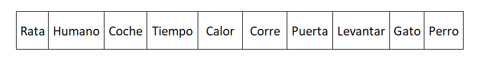
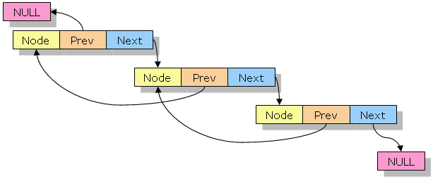

[//]: # ( spellcheck-language es )

<!-- Global site tag (gtag.js) - Google Analytics -->
<script async src="https://www.googletagmanager.com/gtag/js?id=UA-58458282-5"></script>
<script>
  window.dataLayer = window.dataLayer || [];
  function gtag(){dataLayer.push(arguments);}
  gtag('js', new Date());

  gtag('config', 'UA-58458282-5');
</script>

# Listas

## Secuencia de elementos con orden, permite duplicados
## 1, 8, 2, 9, 2, 2, 11, 21, 19, 1, 2, 7, 9



## Ejemplo: Array
### **_Array también tiene posición, y acceso directa por posición_**


___
## Lista enlazada simple


## Cada elemento tiene un 'enlace' al siguiente elemento, 
## o cada nodo tiene un vínculo o referencia a su sucesor


## Manualmente, elemento por elemento
```javascript
let n6 = { value: 11, tail: null };
let n5 = { value: 21, tail: n6 };
let n4 = { value: 11, tail: n5 };
let n3 = { value: 2, tail: n4 };
let n2 = { value: 2, tail: n3 };
let n1 = { value: 1, tail: n2 };

```
## En un golpe, toda la lista
```javascript
let m1 = {
    "value": 1,
    "tail": {
        "value": 2,
        "tail": {
            "value": 2,
            "tail": {
                "value": 11,
                "tail": {
                    "value": 21,
                    "tail": {
                        "value": 11,
                        "tail": null
                    }
                }
            }
        }
    }
};
```

## Con un clase, agregando en bucle
```javascript
class Node {
    constructor(value, tail) {
        this.value = value;
        this.tail = tail ? tail : null;
    }
    addTail(value) {
        this.tail = new Node(value, null);
        return this.tail;
    }
}

let myList = new Node(0);
let last = myList;
for (let i = 1; i < 10; i++) {
    last = last.addTail(i);
}

console.log(JSON.stringify(myList, null, 4));
```

# Lista doblemente enlazada
## Igual que la lista enlazada simple, pero con enlace al predecesor también. 


## Se puede atravesar tanto hacia delante como hacia atrás 

