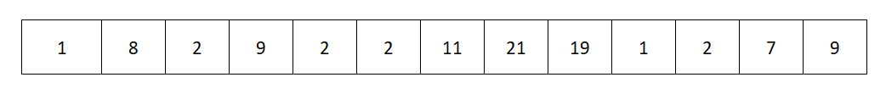
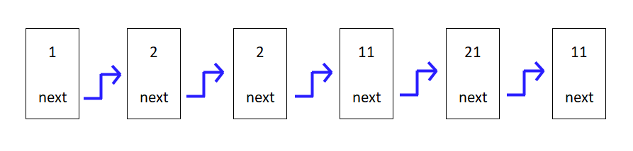
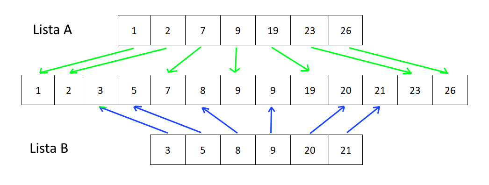
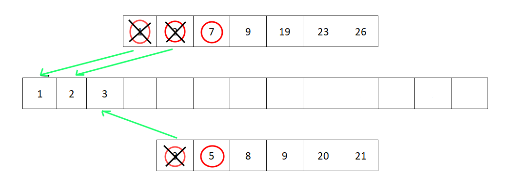

[//]: # ( spellcheck-language es )

# Listas

## Secuencia de elementos con orden, permite duplicados
## 1, 8, 2, 9, 2, 2, 11, 21, 19, 1, 2, 7, 9



## Ejemplo: Array
### **_Array también tiene posición, y acceso directa por posición_**


___
## Lista enlazada simple


## Cada elemento tiene un 'enlace' al siguiente elemento, 
## o cada nodo tiene un vínculo o referencia a su sucesor



## Manualmente, elemento por elemento
```javascript
let n6 = { value: 11, tail: null };
let n5 = { value: 21, tail: n6 };
let n4 = { value: 11, tail: n5 };
let n3 = { value: 2, tail: n4 };
let n2 = { value: 2, tail: n3 };
let n1 = { value: 1, tail: n2 };

```
## En un golpe, toda la lista
```javascript
let m1 = {
    "value": 1,
    "tail": {
        "value": 2,
        "tail": {
            "value": 2,
            "tail": {
                "value": 11,
                "tail": {
                    "value": 21,
                    "tail": {
                        "value": 11,
                        "tail": null
                    }
                }
            }
        }
    }
};
```

## Con un clase, agregando en bucle
```javascript
class Node {
    constructor(value, tail) {
        this.value = value;
        this.tail = tail ? tail : null;
    }
    addTail(value) {
        this.tail = new Node(value, null);
        return this.tail;
    }
}

let myList = new Node(0);
let last = myList;
for (let i = 1; i < 10; i++) {
    last = last.addTail(i);
}

console.log(JSON.stringify(myList, null, 4));
```

# Lista doblemente enlazada
## Igual que la lista enlazada simple, pero con enlace al predecesor también. 


## Se puede atravesar tanto hacia delante como hacia atrás 


# Arrays como listas y Manipulaciones de Arrays

## Dividir una Array en dos partes

```javascript
//Dividir una lista en dos o mas partes

const arr1 = [0, 1, 2, 3, 4, 5, 6, 7, 8, 9, 10];

//Desde posicion 0, hasta posicion 8 no incluido 
//segundo parametro coincide con retorna 8 elementos
//PERO OJO! ese solo es verdade cuando empieza en posicion 0
const part1 = arr1.slice(0, 8); 

const part2 = arr1.slice(8); //Desde posicion 8 hasta el final

//Desde posicion 8 hasta el posicion length no incluida
const part2b = arr1.slice(8, arr1.length);

console.log(...part1);
console.log(...part2);
```


# Ejercicio: Divide un array en dos partes iguales

## Comprueba tu código con este array
```javascript
const arr1 = [0, 1, 2, 3, 4, 5, 6, 7, 8, 9, 10];
```
<br/>
<br/>
<br/>
<br/>
<br/>
<br/>
<br/>
<br/>
<br/>
<br/>
<br/>
<br/>
<br/>
<br/>


# Solucion:

```javascript


var left = arr1.slice(0, Math.round(arr1.length/2));
var right = arr1.slice(Math.round(arr1.length/2));

console.log(...left);
console.log(...right);
```

# Concatenar o combinar Arrays

## Con bucles y push

```javascript
//Concatenar dos arrays en un array nuevo
const arrA = [0, 1, 2, 3, 4, 5, 6];
const arrB = [7, 8, 9, 10];
let merged = [];
for (let e of arrA) {
    merged.push(e);
}
for (let e of arrB) {
    merged.push(e);
}
console.log(merged);
```

## Combinar o concatenar Arrays en ES6 (EcmaScript 2015)

```javascript
const combinado = [...arrA, ...arrB];
console.log(combinado);
```
## Usando el operador _**Spread**_ que es lo tres puntitos **...**

## Operador Spread expande el array en su elementos individuales en el lugar donde se usa


# Ejercicio: 
1. Divide un Array en 3 partes
2. Concatena  los 3 **partes** del array en el orden invertido

<br/>
<br/>
<br/>
<br/>
<br/>
<br/>
<br/>
<br/>
<br/>
<br/>
<br/>
<br/>
<br/>
<br/>


# Solucion:

```javascript


const arrOrg = [0, 1, 2, 3, 4, 5, 6, 7, 8, 9, 10];

const uno = arrOrg.slice(0, Math.round(arrOrg.length/3));
const dos = arrOrg.slice(Math.round(arrOrg.length/3), 2 * Math.round(arrOrg.length/3));
const tres = arrOrg.slice(2 * Math.round(arrOrg.length/3));

const invertido = [ ...tres, ...dos, ...uno];
console.log(...invertido);

```

# Ejercicio
## Inserta un elemento nuevo en la mitad de un array, y pon el string "MITAD" en el nuevo elemento.

```javascript
//Antes
const arrOrg = [0, 1, 2, 3, 4, 5, 6, 7, 8, 9, 10];

//Despues
const arrInserted = [0,1,2,3,4,5,"MITAD",6,7,8,9,10];
```
<br/>
<br/>
<br/>
<br/>
<br/>
<br/>
<br/>
<br/>
<br/>
<br/>
<br/>
<br/>
<br/>
<br/>


# Solucion:

```javascript


const arrInserted =
    [
        ...arrOrg.slice(0, Math.round(arrOrg.length / 2)),
        "MITAD",
        ...arrOrg.slice(Math.round(arrOrg.length / 2))
    ];
console.log(...arrInserted);
```
<br/>
<br/>
<br/>

# Fusionar dos listas ordenadas en una lista ordenada
## Tenemos 2 listas ordenadas, A y B
## ¿Como podemos fusionarlo en una?



## Pasos
## **1.** Miramos el siguiente elemento en cada lista que no hemos cogido, y miramos cual es menor y cogemos el elemento menor y añadimos en  la lista combinada.

## **2.** Si todavía los dos tienen elementos no cogido, volvemos al **1.**

## **3.** Si no hay mas elementos en un lista, añadimos todo lo que quedan en la otra en la lista combinada

### Empezamos


### Siguinte


### Siguinte


### Siguinte



# Lista A y Lista B son de tipo/clase Lista

### Tenemos que saber cual es el siguiente valor que NO hemos cogido, en cada de ellos. Lista tiene una propiedad lista.valorActual

### Cuando tenemos usar o coger un valor en una lista, usamos el metodo lista.cogerActual() que retorna el lista.valorActual y mover la lista al siguiente valor.

## _**¿Como sera el código implementando los pasos anteriores, usando esa Lista?**_

```javascript
function combinarOrdenado(listaA, listaB) {
    //Donde guardar el resultado
    const combinado = new Lista();

    while (listaA.hayMas() && listaB.hayMas()) { //Si en los dos hay mas
        if (listaA.valorActual < listaB.valorActual) {
            combinado.push(listaA.cogerActual());
        }
        else {
            combinado.push(listaB.cogerActual());
        }
    }
    if (listaA.hayMas()) {
        while (listaA.hayMas()) { // Si todavia hay mas en A
            combinado.push(listaA.cogerActual());
        }
    }
    if (listaB.hayMas()) {
        while (listaB.hayMas()) { // Si todavia hay mas en B
            combinado.push(listaB.cogerActual());
        }
    }
    return combinado; //Retornar
}
```

## ¿Podemos simplificar el código?

Si, los
```javascript
if (listaA.hayMas())
```
y
```javascript
if (listaB.hayMas())
```
son redundantes, los 
```javascript
while (listaA.hayMas())
```
y
```javascript
while (listaA.hayMas())
```
dentro los bloques, tambien comprueba si `listaX.hayMas()`

## Simplificado

```javascript
function combinarOrdenado(listaA, listaB) {
    //Donde guardar el resultado
    const combinado = new Lista();

    while (listaA.hayMas() && listaB.hayMas()) { //Si en los dos hay mas
        if (listaA.valorActual < listaB.valorActual) {
            combinado.push(listaA.cogerActual());
        }
        else {
            combinado.push(listaB.cogerActual());
        }
    }
    while (listaA.hayMas()) { // Si todavia hay mas en A
        combinado.push(listaA.cogerActual());
    }
    while (listaB.hayMas()) { // Si todavia hay mas en B
        combinado.push(listaB.cogerActual());
    }
    return combinado; //Retornar
}
```

## _**Ahora solo falta la clase Lista...**_
<br/>
<br/>
<br/>
<br/>
<br/>

# Ejercicio:
## Implementa la clase Lista usado en el ejemplo anterior

<br/>
<br/>
<br/>
<br/>
<br/>
<br/>
<br/>
<br/>
<br/>
<br/>
<br/>
<br/>
<br/>
<br/>


# Solucion:

```javascript
class Lista {
    constructor(array) {
        this._array = array || [];
        this._posicionActual = 0;
    }
    hayMas() {
        return this._posicionActual < this._array.length;
    }
    get valorActual() {
        return this._array[this._posicionActual];
    }
    cogerActual() {
        return this._array[this._posicionActual++];
    }
    push(valor) {
        this._array.push(valor);
    }
}
```

## Alternativa, extendiendo el clase Array
```javascript
class Lista extends Array {
    constructor(args) {
        if (args && args instanceof Array) //Si recibimos un array
            super(...args); //Pasa los elementos individuales al constructor de Array
        else
            super(); //Crea uno vacio
        this._posicionActual = this.length?0:undefined; //Si no hay elementos, no hay posicion
    }
    hayMas() {
        return this._posicionActual < this.length;
    }
    get valorActual() {
        return this[this._posicionActual];
    }
    cogerActual() {
        return this[this._posicionActual++];
    }
}
```

## Comprueba lo todo junto
```javascript
const listaA = new Lista([1, 3, 8, 9, 11, 18]);
const listaB = new Lista([2, 5, 9, 10, 12]);
const ordenado = combinarOrdenado(listaA, listaB);
console.log(...ordenado);
```