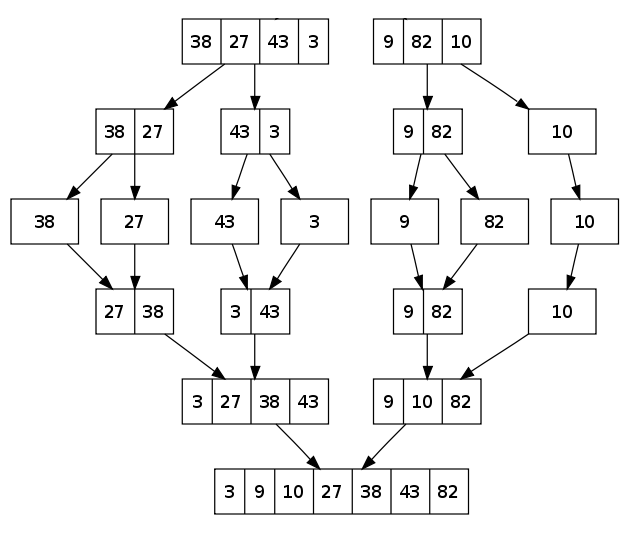

[//]: # ( spellcheck-language es )
<!-- Global site tag (gtag.js) - Google Analytics -->

# Merge sort - Ordenamiento por mezcla

1. Ordena una lista
2. Si la lista solo tiene un elemento, esta ordenada
3. Divide la lista en dos partes, y luego ordena cada lista 
 (recursividad - Vuelve a paso 1 con cada parte/lista)
4. Con los dos listas ordenadas, combina los dos en una lista ordenada
5. Retorna la lista ordenada

