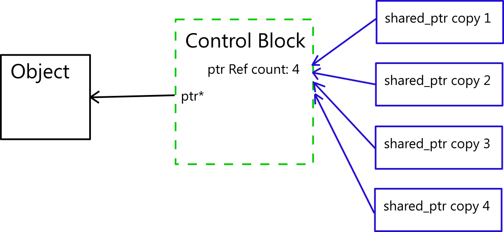
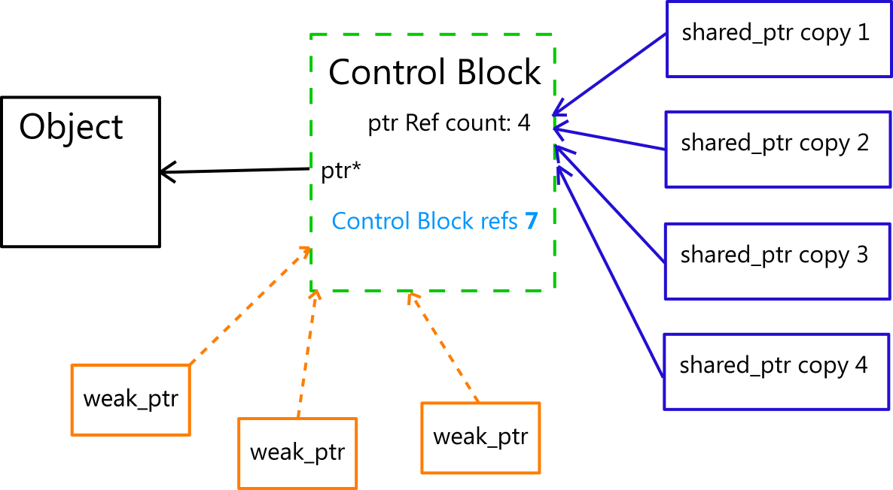

[//]: # ( spellcheck-language es )

# C++ MODERNO - AKA C++ >= 11

Las nuevas características omnipresentes en C++ moderno que muestran por qué el código de C++ 11 y más allá es limpio, seguro y rápido, tan limpio y seguro como el código escrito en cualquier otro lenguaje moderno y corriente, y con el rendimiento tradicional de C++ tan fuerte como siempre.
Maneras que hacer que el código sea más robusto y más fácil de mantener, como evitar fugas de memoria, más validación durante compilación, asegurar como evitar una resolución de sobrecarga incorrecta o no intencionada, y maneras para facilitar refactorización de código y más.

Miramos patrones y paradigmas como hacer el código escalable y robusto con mejores prácticas de multihilo, concurrencia y minimización de “cuellos de botella” y bloqueos.


# Peligros comunes en C++ al devolver referencias

## Devolución de referencias a memoria asignada del stack
```cpp
int& getOnStack() {
    int stackValue = 123;
    return stackValue;  // DON'T DO THIS.
}
```
La memoria asignada para la referencia desaparece, y quedas con una referencia a memoria aleatoria
<br/>

## Devolución de referencia a memoria asignada del heap
```cpp
int& getSomething() {
    int* heapValue = new int;
    return *heapValue;  // DON'T DO THIS.
}
```
Ahora el llamador tendrá que hacer cosas ' extrañas ' para obtener el puntero original fuera de la referencia para eliminarlo, o simplemente no se da cuenta que haya una asignación memoria del heap que requiera la eliminación.

## No notó el valor fue devuelto por referencia
```cpp
int anyOldInt = getSomething(); //Storing a copy in stack variable, original reference lost!
```

## Olvidándose de conseguir mantener la referencia, pero todavía tratando de liberar la memoria
```cpp
int not_good = getSomething(); 
delete &not_good;   // Mal asunto, intentar eliminar la memoria de una variable asignada del stack
```

## Extraña manera de liberar la memoria del puntero
```cpp
int& myRef = getSomething(); // ¡Debemos usar el &, para no perder la referencia!
delete &myRef;               // y obtener el puntero subyacente para eliminar... extraño
```

## Hay situaciones perfectamente valido retornar referencias
```cpp
int& getInt()
{
   static int x = 4;
   return x;
}
```
## Por ejemplo singletons
```cpp
Class Singleton
{
    public:
        static Singleton& instance()
        {
            static Singleton instance;
            return instance;
        };
}
```
### Pero si no es necesario, evita devolver referencias, utilice un patrón para pasar la responsabilidad del recurso
## Normalmente se utiliza <span class="hljs-built_in">std::unique_ptr&lt;T&gt;</span> y dejar que administre la vida útil del objeto

```cpp
std::unique_ptr<int> getSomething() {
    return std::make_unique<int>(123);
}
```
Y el código de llamada simplemente mantiene el puntero mientras de la instancia de <span class="hljs-built_in">std::unique_ptr&lt;T&gt;</span> existe.


```cpp
std::unique_ptr<int> x = getSomething();
```

# Ejemplo de <span class="hljs-built_in">std::unique_ptr&lt;T&gt;</span> con clase 
```cpp
class UPTest {
public:
	UPTest(int id):
		_id(id)
	{ }
	~UPTest() {
		cout << "deleted UPTest " << _id << el;
	}
	int _id;
};
```
```cpp
std::unique_ptr<UPTest> getSomething() {
	static int c = 1;
	return std::make_unique<UPTest>(c++);
}

std::unique_ptr<UPTest> getAnotherOne()
{
	std::unique_ptr<UPTest> x = getSomething();
	return x;
}

void doStuff(std::unique_ptr<UPTest> o)
{
	cout << "Doing stuff with UPTest " << o->_id << el;
}

void uniquePtr()
{
    std::unique_ptr<UPTest> x = getSomething();
    std::unique_ptr<UPTest> y = getAnotherOne();

    //std::unique_ptr<UPTest> x1(x);    // ERROR! error C2280: 'std::unique_ptr<UPTest... : attempting to reference a deleted function
    std::unique_ptr<UPTest> x2;
    //x2 = x;                   // ERROR! error C2280: 'std::unique_ptr<UPTest... : attempting to reference a deleted function

    x2 = std::move(y); //Move semantics required, moves the own pointer from one to the other

    doStuff(std::move(x)); //Pass along the pointer and ownership
    assert(x == nullptr);
    assert(y == nullptr);
    assert(x2 != nullptr);
    cout << x2->_id << el;

    //But you can still do this
    UPTest* pUP = new UPTest(12);

    auto up3 = std::unique_ptr<UPTest>(pUP);
        
    //delete pUP; //BAD, when up3 goes out of scope it will double delete the pUP pointer
}
```

# Evitar creation y destrucion de puntero crudo cuando deberia usar <span class="hljs-built_in">std::unique_ptr&lt;T&gt;</span> con una clase 
```cpp
class EnforceUniquePtr
{
public:
	static std::unique_ptr<EnforceUniquePtr> create()
	{
		static int i = 1;
		return std::unique_ptr<EnforceUniquePtr>(new EnforceUniquePtr(i++));
	}
	int i() const { return _i; }
private:
	friend std::default_delete<EnforceUniquePtr>; //Allow unique_ptr to call our destructor

	EnforceUniquePtr(int i){}
	~EnforceUniquePtr() {
		cout << "destructing EnforceUniquePtr " << _i << el;
	}
	int _i { 0 };
};


void doThingsWithRawPointer(const EnforceUniquePtr* p)
{
	cout << "Processing EnforceUniquePtr " << p->i() << el;
}

void enforceUniquePtr()
{
	auto o = EnforceUniquePtr::create();

    //error C2248: 'EnforceUniquePtr::EnforceUniquePtr' : cannot access private member declared in class 'EnforceUniquePtr'
	//auto sp = new EnforceUniquePtr(); 

	//auto p = std::make_unique<EnforceUniquePtr>(1); //NO, constructor private
	//auto p2 = std::unique_ptr<EnforceUniquePtr>(new EnforceUniquePtr(2)); //NO, constructor private

	//But you can still do this
	EnforceUniquePtr* pEU = o.get();

	doThingsWithRawPointer(pEU); //Typically to call code that already expects a raw pointer

    //Bad idea, you will have two std::unique_ptr owning the same pointer
	std::unique_ptr<EnforceUniquePtr> p2 = std::unique_ptr<EnforceUniquePtr>(pEU); 
	
	pEU = p2.release(); //Now cleared up, p is the only unique_ptr owning it

	assert(p2 == nullptr);

	//delete pEU; //Cannot do this, destructor is private
}
```

## Usando static std::unique_ptr para reclamar recursos cuando hilos terminan


# <span class="hljs-built_in">std::shared_ptr</span>

## ¿Para que sirve <span class="hljs-built_in">std::shared_ptr</span>?
<!-- Good article at http://www.modernescpp.com/index.php/std-shared-ptr  -->

* Cuando un recurso tiene various dueños.
* Cuando hay referencia y usos de un objecto desde varios 'lugares', y no es deterministico, o depende de la ejecucion cual va ser el ultimo para usar el puntero.
* El ultimo que usa, descarta su shared_ptr, y entonces como no hay mas referencias al puntero, el shared_ptr detecta eso y lo destruye el objecto del puntero crudo y el bloque de control.
* Es seguro para multi-hilo, _pero_ _ojo_ con tu objeto detras del puntero crudo, necesitara proteccion de concurrencia tambíen.

## Comportamiento
* Cada vez que se copia un <span class="hljs-built_in">std::shared_ptr</span>, se incrementa el conteo de referencias.
* Así cada copia es uno de los dueños del recurso/puntero.
* Cuando no hay mas copias del <span class="hljs-built_in">std::shared_ptr</span> que refere al mismo recurso, es destruido.

```cpp


```




# <span class="hljs-built_in">std::weak_ptr</span>




# El <span class="hljs-built_in">auto_ptr&lt;T&gt;</span> esta obsoleto, y nunca fue bueno. ¡No lo uses nunca jamás!!