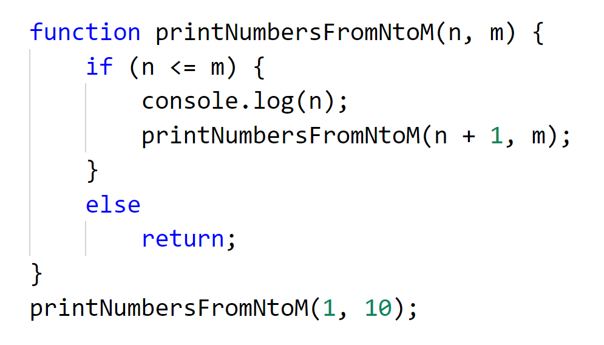

[//]: # ( spellcheck-language en )

[En Español](./recursion_es.html)
# Recursion
## To understand recursion, understand one bit of recursion then the rest of recursion.

In everyday live we are surrounded by recursion, there are recursive structures every where both man made and in nature, many repetitive tasks are recursive or can be viewed as recursive.

##  Traditional nested Matryoshka dolls are recursive in structure

## Infinite recursion at play: A picture of a picture of a picture a picture...  

 Nested recursive picture of a picture of a picture... courtesy of Imgur

## Better our hands aren´t recursive...  

 Recursive hand from the movie Dr. Strange

# Read a book with 100 pages using a recursive approach

1. **Problem:** Read a book with 100 pages 
  **Solution:** If there are pages unread, read one page and then read a book with 99 pages.

2. **Problem:** Read a book with 99 pages 
  **Solution:** If there are pages unread, read one page and then read a book with 98 pages.

3. **Problem:** Read a book with 98 pages 
  **Solution:** If there are pages unread, read one page and then read a book with 97 pages.

3. **Problem:** Read a book with 97 pages 
  **Solution:** If there are pages unread, read one page and then read a book with 96 pages.

### ........ steps excluded for brevity ..........

99. **Problem:** Read a book with 2 pages 
  **Solution:** If there are pages unread, read one page and then read a book with 1 page.
 
100. **Problem:** Read a book with 1 pages 
  **Solution:** If there are pages unread, read one page and then read a book with 0 pages.

101. **Problem:** Read a book with 0 pages 
  **Solution:** If there are pages unread, no pages unread so you stop here!

# General solution: Read a book with **n** pages

1. **Problem:** Read a book with **n** pages 
  **Solution:** If there are pages unread, read one page and then read a book with  **n-1** pages.

2. **Problem:** Read a book with **n-1** pages 
  **Solution:** If there are pages unread, read one page and then read a book with **n-2** pages.

### ........ repeat until ..........

**n+1**. **Problem:** Read a book with **n-n** (0) pages 
  **Solution:** There are no pages unread, so you stop here!

# Say out loud all the numbers from 1 to 5
1. **Problem:** Say out loud all the numbers from 1 to 5
  **Solution:** Say out loud number 1, then say out loud the numbers from 2 to 5

2. **Problem:** Say out loud all the numbers from 2 to 5
  **Solution:** Say out loud number 2, then say out loud the numbers from 3 to 5

3. **Problem:** Say out loud all the numbers from 3 to 5
  **Solution:** Say out loud number 3, then say out loud the numbers from 4 to 5

4. **Problem:** Say out loud all the numbers from 4 to 5
  **Solution:** Say out loud number 4, then say out loud the numbers from 5 to 5

5. **Problem:** Say out loud all the numbers from 5 to 5
  **Solution:** Say out loud number 5, then there are no more numbers to say

# Generalized solution: Say out loud all the numbers from **n** to **m**
1. **Problem:** Say out loud all the numbers from **n** to **m**
  **Solution:** Say out loud number **n**, then say out loud the numbers from **n+1** to **m**

2. **Problem:** Say out loud all the numbers from **n+1** to **m**
  **Solution:** Say out loud number **n+1**, then say out loud the numbers from **(n+1)+1** to **m**

### ........ repeat ..........

**x+1**. **Problem:** Say out loud all the numbers from **n+x** to **m**, where **n+x == m**
  **Solution:** Say out loud number **n+x**, when **n+x == m** there are no more numbers to say

# Now with programming....
Instead of saying out loud the numbers, let's print them in the console...
# Print all the numbers from 1 to 5 on the console

1. **Problem:** Print all the numbers from 1 to 5
  **Solution:** Print the number 1, then print the numbers from 2 to 5

2. **Problem:** Print all the numbers from 2 to 5
  **Solution:** Print the number 2, then print the numbers from 3 to 5

3. **Problem:** Print all the numbers from 3 to 5
  **Solution:** Print the number 3, then print the numbers from 4 to 5

4. **Problem:** Print all the numbers from 4 to 5
  **Solution:** Print the number 4, then print the numbers from 5 to 5

5. **Problem:** Print all the numbers from 5 to 5
  **Solution:** Print the number 5, then there are no more numbers to print!

# Generalized solution: Print all the numbers from **n** to **m**
1. **Problem:** Print all the numbers from **n** to **m**
  **Solution:** Print the number **n**, then print the numbers from **n+1** to **m**

2. **Problem:** Print all the numbers from **n+1** to **m**
  **Solution:** Print the number **n+1**, then print the numbers from **(n+1)+1** to **m**

### ........ repeat ..........

**x+1**. **Problem:** Print all the numbers from **n+x** to **m**, where **n+x == m**
  **Solution:** Print the number **n+x**, when **n+x == m** there are no more numbers print!

# With JavaScript code

